# My List 

Welcome to the My List live link [My List](https://marceillo.github.io/my-list/).

This is a list for people to add to do tasks or any other item they would like to add for example a grocery list or any idea they wish to add. The name My List was chosen to be a functional tool to help with daily life and tasks. It's a plain, simple list with little distractions or images in the body. You can add items mark them as completed and delete them when needed.

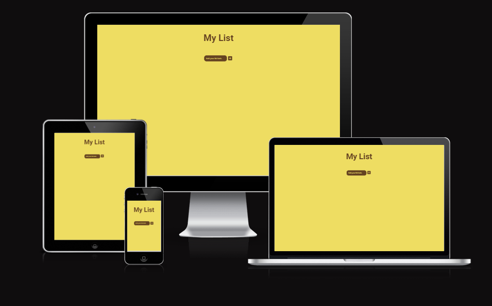

# Contents
* [**Site Overview**](#My-List)
* [**User Experience**](#user-experience)
    * [Wireframes](#wireframes)
    * [Site Structure](#site-structure)
    * [Design Choices](#design-choices)
    *  [Typography](#typography)
    *  [Colour Scheme](#colour-scheme)
* [**Features**](#features)
   * [Existing Features](#existing-Features)                        
   * [**Inspiration**](<#inspiration>)
   * [**Future Features**](<#future-features>)
* [**Technologies Used**](<#technologies-used>)
* [**Testing**](#testing)
* [**Deployment**](#deployment)
* [**Credits**](#credits)
    * [**Content**](#content)
    * [**Media**](#media)
*  [**Acknowledgements**](#acknowledgements)
  
# User Experience

## Wireframes

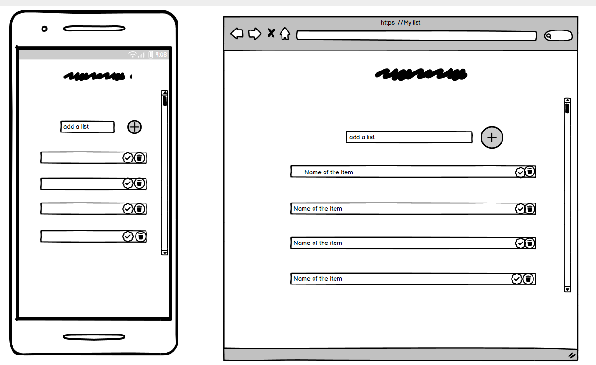

## Site Structure

- The site has a basic HTML structure  with a heading.
- Below the heading is an input section and a button to add text.
- Once the text is added, the user can check and delete the task.
- The focus was on the JavaScript code to create functionality for the site.
  
## Design Choices

- The idea is to make the list minimalist to improve the user's thought process.
- The list below has a checked button and a delete button to add some user functionality.
- It has added functionality by utilizing the local storage of the browser so when you exit and return your items are still there.

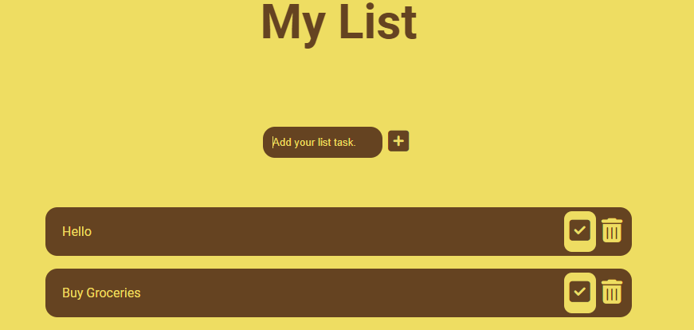
  
## Colour Scheme  

- A two-tone color pallet was used for this site.
- The buttons have the same colors and are inverted to improve visibility.
- When you check the button it has a line through  text style and turns green to indicate that it has been checked.
  
## Features

### Existing Features

- Favicon is a picture of a list to indicate this is a to-do list.
  
#### Javascript adding new tasks to the list. 

 - Java script function to add the task on the page and to the local storage.
   
    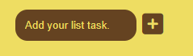
   
 - The input field has a delete button and a checked button that removes items from the list
   
   
   
 - Function for deleting in JS was also set to remove from Local Storage with the delete trashcan button.
 - The checked button has a line through once checked 
 
##### Delete trashcan  Button  
 
 - The delete button has a hover style function to indicate to the user they are clicking on it.
 - This button removes the item from the list the user no longer needs and from local storage as well.
 
 ##### Checked  Button

- When this button is checked, a line through function is created in Java script to indicate that the task has been completed to the end user.
- The second feature is to update the to-list that the button has been checked and to keep it saved in that format.

#### Inspiration

- I like to use a to-do list daily as it is a functional tool.
- I like using apps daily such as Google Keep.
  
#### Future Features
I would have liked to add more functionality to the list so that the user has more control such as below.

 - Function to change the color schemes.
 - Able to edit the list after adding it as a task.
 - Able to import pictures to their tasks.
 - Able to archive their tasks.
 - Different windows for different tasks.
 - Alert function to alert users of tasks based on the date set for them to be completed.
   
## Technologies Used

- [HTML5](https://dev.w3.org/html5/spec-LC/introduction.html) - provides the content and structure for the website.
- [CSS](https://www.w3.org/Style/CSS/Overview.en.html) - provides the styling.
- [Java](https://www.w3schools.com/whatis/whatis_js.asp) Java script that provides more functionality to the site.
- [Balsamiq](https://balsamiq.com/wireframes/) - used to create the wireframes.
- [Gitpod](https://www.gitpod.io/#get-started) - used to deploy the website.
- [Github](https://github.com/) - used to host and edit the website.
- [Am I responsive](https://ui.dev/amiresponsive) - This tool tests the site's responsiveness and provides an image used at the beginning of the document. 
- [Jigsaw validator](https://jigsaw.w3.org/css-validator/) - used to look for errors and non-standard CSS code.
- [W3C validator](https://validator.w3.org/) - used to look for errors and non-standard HTML code.
- Google Chrome's lighthouse for performance and accessibility tests for mobile and desktop modes.
- [Jshint](https://jshint.com/) To detect errors and problems in the javacode.
- [HTML validator](https://validator.w3.org/) To detect errors and problems in HTML.
- [CSS validator](https://jigsaw.w3.org/css-validator/) To detect errors and problems in CSS.
  
## Testing 

### Validator Testing 

- HTML
  - HTML Validator [HTML validator](https://validator.w3.org/)
  - Errors found by W3C validator
    
    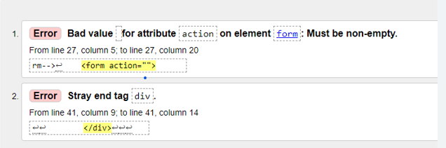

  - Error one cleared: Cleared the error by adding an ID and method element in the structure.
  - Error two cleared: Cleared by a typo in the form structure.
  
  - Errors cleared
    
    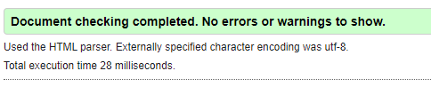
       
      
- CSS
- CSS validator [CSS validator](https://jigsaw.w3.org/css-validator/)
  
    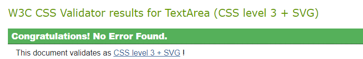
  
- JavaScript
    - Errors found in Jshint Validator [Jshint validator](https://jshint.com/)
       
      - The following metrics were returned:

          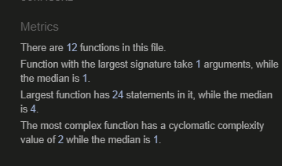
        
      - ES6 warning found
        
        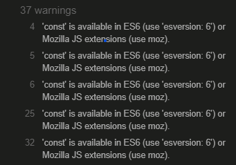
        
      - ES6 warning: Cleared by adding this comment to the top of the script /* jshint esversion: 6 */
        
      - Warnings cleared:
       
        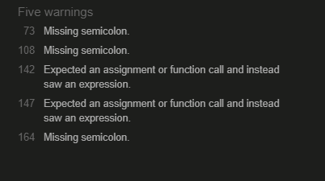
      
      - Semicolon error: Included semicolons to text.
      - Changed the == to = as this was incorrect.
        
- Lighthouse
     - Desktop Result

       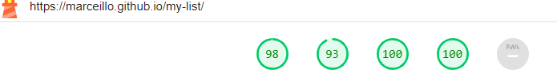
            
     - Mobile Result

       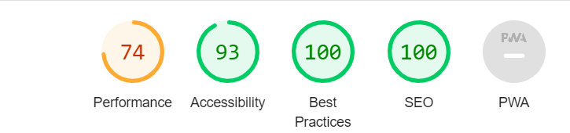

-The My List site was tested on the following browsers with no visible issues for the user. 
- Google Chrome
- Mozilla Firefox
- Microsoft Edge
- Brave 
 
-The responsive design was done manually with Chrome development tools built into the browser.

|        | Galaxy Fold | Galaxy S8+ | iPhone 12pro | iPad mini  | iPad pro | Display <1024px | Display >1025px
|--------|---------|-----------|----------|------|----------|-----------------|-----------------|
| Render | pass    | pass      | pass     | pass | pass     | pass            | pass            |
| Images | pass    | pass      | pass     | pass | pass     | pass            | pass            |
| Links  | pass    | pass      | pass     | pass | pass     | pass            | pass            |
                      
    

### Unfixed Bugs

- I had a problem with the border-radius style when you added a new task to the input field. As it was not working I found a parent with the same rule and deleted the duplicate rule and this repaired my problem.
- I had a problem with how the border in the element div from JS is displayed. The solution in the end was to program JS to use a different class name and this resolved the issues. 
- The buttons for delete and checked had the issue as when you clicked on the icon element it did not work but when you clicked near it worked. Adjusted the function to see the whole element in Js.
- Local storage I had a problem with updating the checked and keeping it persist after refresh. Unfortunately have not found a solution.
- steps taken
  - 

## Deployment

Deployed the site on GitHub using the following procedure:

1. By clicking Repository/settings/pages 
2. Selecting the source tab then change to the main branch and save.
3. I then visited the deployed site and viewed the live site.

The instruction link below on how to fork a project:

[Fork the project]([https://dev.w3.org/html5/spec-LC/introduction.html](https://docs.github.com/en/pull-requests/collaborating-with-pull-requests/working-with-forks/fork-a-repo)

The instruction link below on how to clone a project:

[Clone the project]([https://github.com/](https://docs.github.com/en/repositories/creating-and-managing-repositories/cloning-a-repository) 

## Credits 
  
You can break the credits section up into Content and Media, depending on what you have included in your project. 
https://kit.fontawesome.com/3b20d96fa9.js

- [Favicon](https://icons8.com/icons/set/favicon-todo-list)
- [W3schools](https://www.w3schools.com/)
- [Stackoverflow](https://stackoverflow.com/)
- [Youtube](youtube.com)
- [W3docs](https://www.w3docs.com/)
- [For local storage](https://www.tutorialstonight.com/to-do-list-javascript)
- [Localstorage guide](-https://blog.logrocket.com/localstorage-javascript-complete-guide/)
- [Clear the es js](https://stackoverflow.com/questions/54647294/const-is-available-in-es6-use-esversion-6)
- [build a to-do list]( https://thecodingpie.medium.com/how-to-build-a-todo-list-app-with-javascript-and-local-storage-a884f4ea3ec)

### Content 

#### YouTube tutorial that helped
- [Tutorial guide for YouTube](https://www.youtube.com/watch?v=Ttf3CEsEwMQ&list=WL&index=33)
- [JavaScript LocalStorage](https://www.youtube.com/watch?v=zmFDvFwj6-8&list=WL&index=29)
- [Build a Todo List App](https://www.youtube.com/watch?v=6eFwtaZf6zc&list=WL&index=21)
- [How To Create a To-Do List App](https://www.youtube.com/watch?v=CsO0UJSqaw0&list=WL&index=10)

### Media

- The photos used on the home and sign-up page are from This Open Source site
- The images used for the gallery page were taken from this other open-source site

## Acknowledgements

- I would like to thank my fellow student Sebastian Kefer for providing good troubleshooting ideas when I was stuck on bugs or problems it is nice to have support in these times.
- Thank you to my mentor who has helped guide me in this project.
   

