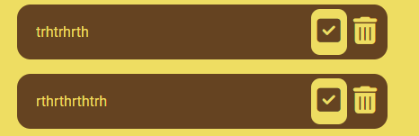

# My List 

Welcome to the My List live link [My List](https://marceillo.github.io/my-list/).

This is a list for people to add to do tasks or any other item they would like to add for example a grocery list or any idea they wish to add. The name My List was chosen to be a functional tool to help with daily life and tasks. It's a plain, simple list with little distractions or images in the body. You can add items mark them as completed and delete them when needed.

# Contents
* [**Site Overview**](#My-List)
* [**User Experience**](#user-experience)
    * [Wireframes](#wireframes)
    * [Site Structure](#site-structure)
    * [Design Choices](#design-choices)
    *  [Typography](#typography)
    *  [Colour Scheme](#colour-scheme)
* [**Features**](#features)
   * [Existing Features](#existing-Features)                        
   * [**Inspiration**](<#inspiration>)
   * [**Future Features**](<#future-features>)
* [**Technologies Used**](<#technologies-used>)
* [**Testing**](#testing)
* [**Deployment**](#deployment)
* [**Credits**](#credits)
    * [**Content**](#content)
    * [**Media**](#media)
*  [**Acknowledgements**](#acknowledgements)
  
# User Experience

## Wireframes

## Site Structure

- The site has a basic HTML structure  with a heading.
- Below the heading is an input section and a button to add text.
- Once the text is added, the user can check and delete the task.
- The focus was on the JavaScript code to create functionality for the site.
  
## Design Choices

- The idea is to make the list minimalist to improve the user's thought process.
- The list below has a checked button and a delete button to add some user functionality.

  
## Colour Scheme  

- A two-tone color pallet was used for this site.
- The buttons have the same colors and are inverted to improve visibility.
  
## Features

### Existing Features

- Favicon is a picture of a list to indicate this is a to-do list.
- Input text
- Add Button
  
#### Javascript adding new tasks to the list. 

 - Java script function to add the task on the page and to local storage.
   
    
   
 - The input field has a delete button and a checked button that removes items from the list
   
   
   
 - Function for deleting in JS was also set to remove from Local Storage with the delete trashcan button.
 - The checked button has a line through once checked 
 
##### Delete trashcan  Button  
 
 - The delete button has a hover style function to indicate to the user they are clicking on it.
 - This button removes the item from the list the user no longer needs and from local storage as well.
 
 ##### Checked  Button

- When this button is checked, a line through function is created in Java script to indicate that the task has been completed to the end user.
- The second feature is to update the to-list that the button has been checked and to keep it saved in that format.

#### Inspiration

- I like to use a to-do list daily as it is a functional tool.
- I like using apps daily such as Google Keep.
  
#### Future Features
I would have liked to add more functionality to the list so that the user has more control such as below.

 - Function to change the color schemes.
 - Able to edit the list after adding it as a task.
 - Able to import pictures to their tasks.
 - Able to archive their tasks.
 - Different windows for different tasks.
 - Alert function
   
## Technologies Used

- [HTML5](https://dev.w3.org/html5/spec-LC/introduction.html) - provides the content and structure for the website.
- [CSS](https://www.w3.org/Style/CSS/Overview.en.html) - provides the styling.
- [Java](https://www.w3schools.com/whatis/whatis_js.asp) Java script that provides more functionality to the site.
- [Balsamiq](https://balsamiq.com/wireframes/) - used to create the wireframes.
- [Gitpod](https://www.gitpod.io/#get-started) - used to deploy the website.
- [Github](https://github.com/) - used to host and edit the website.
- [Am I responsive](https://ui.dev/amiresponsive) - This tool tests the site's responsiveness and provides an image used at the beginning of the document. 
- [Jigsaw validator](https://jigsaw.w3.org/css-validator/) - used to look for errors and non-standard CSS code.
- [W3C validator](https://validator.w3.org/) - used to look for errors and none standard HTML code.
- Google Chrome's lighthouse for performance and accessibility tests for mobile and desktop modes.
- [Jshint](https://jshint.com/) To detect errors and problems in the javacode.
- [HTML validator](https://validator.w3.org/) To detect errors and problems in HTML.
- [CSS validator](https://jigsaw.w3.org/css-validator/) To detect errors and problems in CSS.
  
## Testing 

### Validator Testing 

- HTML
  - HTML Validator [HTML validator](https://validator.w3.org/)
  - Errors found by W3C validator
    
    

  - Error one cleared: Cleared the error by adding an ID and method element in the structure.
  - Error two cleared: Cleared by a typo in the form structure.
  
  - Errors cleared
    
    
       
      
- CSS
- CSS validator [CSS validator](https://jigsaw.w3.org/css-validator/)
  
    
  
- JavaScript
    - Errors found in Jshint Validator [Jshint validator](https://jshint.com/)
       
      - The following metrics were returned:

          
        
      - ES6 warning found
        
        
        
      - ES6 warning: Cleared by adding this comment to the top of the script /* jshint esversion: 6 */
        
      - Warnings cleared:
       
        
      
      - Semicolon error: Included semicolons to text.
      - Changed the == to = as this was incorrect.
        
- Lighthouse
     - Desktop Result
     
     - Mobile Result

-The My List site was tested on the following browsers with no visible issues for the user. 
    - Google Chrome
    - Mozilla Firefox
    - Microsoft Edge
    - Brave 
 
-The responsive design was done manually with Chrome development tools built into the browser.

|        | Galaxy Fold | Galaxy S8+ | iPhone 12pro | iPad mini  | iPad pro | Display <1024px | Display >1025px
|--------|---------|-----------|----------|------|----------|-----------------|-----------------|
| Render | pass    | pass      | pass     | pass | pass     | pass            | pass            |
| Images | pass    | pass      | pass     | pass | pass     | pass            | pass            |
| Links  | pass    | pass      | pass     | pass | pass     | pass            | pass            |
                      
    

### Unfixed Bugs

You will need to mention unfixed bugs and why they were not fixed. This section should include shortcomings of the frameworks or technologies used. Although time can be a big variable to consider, paucity of time and difficulty understanding implementation is not a valid reason to leave bugs unfixed. 

## Deployment

This section should describe the process you went through to deploy the project to a hosting platform (e.g. GitHub) 

- The site was deployed to GitHub pages. The steps to deploy are as follows: 
  - In the GitHub repository, navigate to the Settings tab 
  - From the source section drop-down menu, select the Master Branch
  - Once the master branch has been selected, the page will be automatically refreshed with a detailed ribbon display to indicate the successful deployment. 

The live link can be found here - https://code-institute-org.github.io/love-maths/

## Credits 
  
In this section you need to reference where you got your content, media and extra help from. It is common practice to use code from other repositories and tutorials, however, it is important to be very specific about these sources to avoid plagiarism. 

You can break the credits section up into Content and Media, depending on what you have included in your project. 
https://kit.fontawesome.com/3b20d96fa9.js

- [Favicon](https://icons8.com/icons/set/favicon-todo-list)
- [W3schools](https://www.w3schools.com/)
- [Stackoverflow](https://stackoverflow.com/)
- [Youtube](youtube.com)
- [W3docs](https://www.w3docs.com/)
- [For local storage](https://www.tutorialstonight.com/to-do-list-javascript)
- [Localstorage guide](-https://blog.logrocket.com/localstorage-javascript-complete-guide/)
- [Clear the es js](https://stackoverflow.com/questions/54647294/const-is-available-in-es6-use-esversion-6)

### Content 

- The text for the Home page was taken from Wikipedia Article A
- Instructions on how to implement form validation on the Sign Up page was taken from [Specific YouTube Tutorial](https://www.youtube.com/)
- The icons in the footer were taken from [Font Awesome](https://fontawesome.com/)

### Media

- The photos used on the home and sign up page are from This Open Source site
- The images used for the gallery page were taken from this other open source site

Congratulations on completing your Readme, you have made another big stride in the direction of being a developer! 

## Acknowledgements

## Other General Project Advice

Below you will find a couple of extra tips that may be helpful when completing your project. Remember that each of these projects will become part of your final portfolio so it’s important to allow enough time to showcase your best work! 

- One of the most basic elements of keeping a healthy commit history is with the commit message. When getting started with your project, read through [this article](https://chris.beams.io/posts/git-commit/) by Chris Beams on How to Write  a Git Commit Message 
  - Make sure to keep the messages in the imperative mood 

- When naming the files in your project directory, make sure to consider meaningful naming of files, point to specific names and sections of content.
  - For example, instead of naming an image used ‘image1.png’ consider naming it ‘landing_page_img.png’. This will ensure that there are clear file paths kept. 

- Do some extra research on good and bad coding practices, there are a handful of useful articles to read, consider reviewing the following list when getting started:
  - [Writing Your Best Code](https://learn.shayhowe.com/html-css/writing-your-best-code/)
  - [HTML & CSS Coding Best Practices](https://medium.com/@inceptiondj.info/html-css-coding-best-practice-fadb9870a00f)
  - [Google HTML/CSS Style Guide](https://google.github.io/styleguide/htmlcssguide.html#General)

Getting started with your Portfolio Projects can be daunting, planning your project can make it a lot easier to tackle, take small steps to reach the final outcome and enjoy the process!

